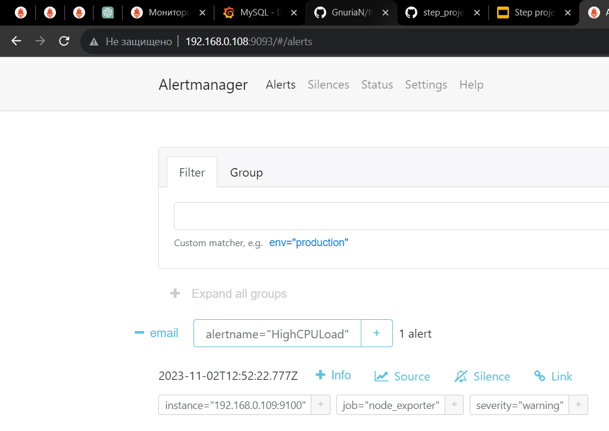

## step_project_1 >> vagrant configuration:
* deploying an environment with two virtual machines
* the role of the first machine is an supervisor
* the "supervisor" is deployed with pre-installed: Grafana, Prometheus, Prometheus Alert manager


* the role of the second machine is a subordinate
* the "subordinate" is deployed with pre-installed: MysqlServer, Prometheus mysql exporter, Prometheus node exporter


* prometheus mysql exporter collects metrics from mysql server ("shop_db" database including)


* data collection is configured in the files: mysqld_exporter.cnf and /etc/systemd/system/mysql_exporter.service (detailed in `prometheus_mysql_exporter-install.sh`)


* further in the file `mysql_server-install.sh` a database `"shop_db"` is created as well as a user who collects metrics with the specific access rights


## further settings are made manually >>

* configurations for collecting metrics from mysql_exporter are added into `prometheus.yml` file


* prometheus successfully collects metrics from "subordinate"


* pre-installed Alertmanager is configured (`/etc/alertmanager/alertmanager.yml`) to send notifications by email 

```
global:
  resolve_timeout: 30s

route:
  group_by: ['alertname']
  group_wait: 10s
  group_interval: 10s
  repeat_interval: 10s
  receiver: 'email'
receivers:
- name: 'email'
  email_configs:
  - to: 'laptii.dm@gmail.com'
    from: 'laptii.dm@gmail.com'
    smarthost: smtp.gmail.com:587
    auth_username: 'laptii.dm@gmail.com'
    auth_identity: 'laptii.dm@gmail.com'
    auth_password: 'pass pass pass pass'
inhibit_rules:
  - source_match:
      severity: 'critical'
    target_match:
      severity: 'warning'
    equal: ['alertname', 'dev', 'instance']
```
* in `/etc/prometheus/` the rule-file `node_load1.rules.yml`is created

```
groups:
  - name: node_load1
    rules:
      - alert: HighCPULoad
        expr: node_load1 > 0.3
        for: 1m
        labels:
          severity: warning
        annotations:
          description: 'High CPU load detected ({{ $value }})'

```
* after saving the configurations we receive a notification by email




* adding Prometheus as a data source in Grafana     

 

* dashboards


